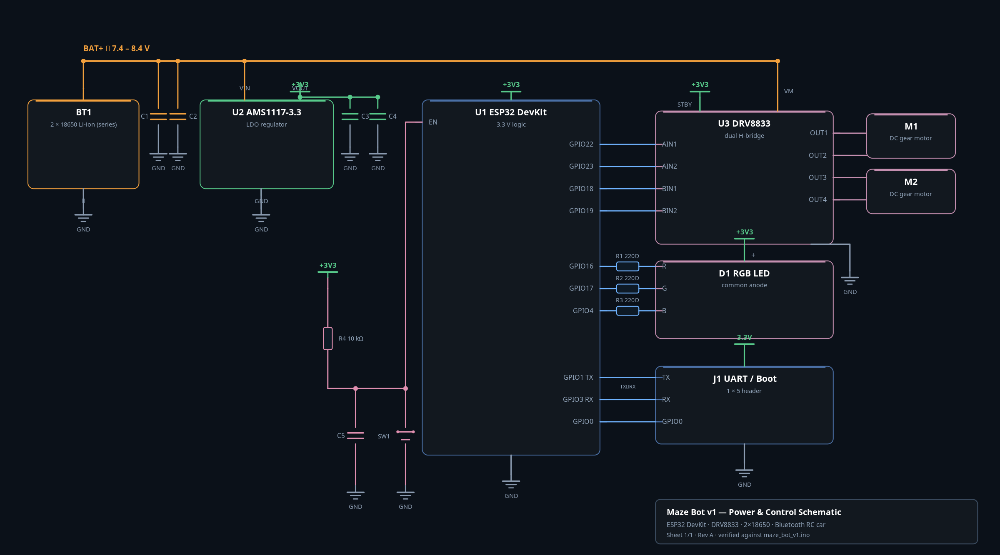

# Mini Bot — ESP32 Bluetooth Robot Car

A compact, Bluetooth-controlled robot built around an **ESP32**, a **DRV8833** dual H-bridge, and a hand-wired power / noise-filter section on a prototype perf board. Drive it from any phone with a Bluetooth serial terminal.

> *"Designed and developed a wireless bot using ESP32 SoC. Integrated microcontroller, motor driver (DRV8833) and power management and noise filter circuits into a compact prototype perf board. Used compact size motors to make the bot in smaller dimensions."*
> — project write-up on LinkedIn

---

## Features

- **Bluetooth Classic (SPP) control** — the board advertises itself as `ESP32_Car`
- **Directional control** — forward, backward, left, right and stop
- **3 speed levels** via PWM (LEDC, 5 kHz, 8-bit resolution)
- **Common-anode RGB status LED** — red = waiting for connection, green = connected/idle, blue = moving
- **On-board power chain** — 2 × 18650 (≈7.4 V) → AMS1117-3.3 → single 3.3 V rail, with input/output decoupling
- **Reset circuit + UART/boot header** for reliable flashing
- Compact footprint: small DC gear motors and a single perf-board build

---

## Hardware

| Qty | Part | Notes |
|----:|------|-------|
| 1 | ESP32 DevKit (ESP32-WROOM) | main controller, Bluetooth |
| 1 | DRV8833 dual H-bridge module | drives both motors |
| 2 | DC gear motors (compact) | left + right drive |
| 2 | 18650 Li-ion cells in series | ≈7.4 V – 8.4 V pack |
| 1 | AMS1117-3.3 LDO regulator | 3.3 V rail |
| 1 | Common-anode RGB LED | status indicator |
| 3 | Resistors 220–330 Ω | RGB current limiting |
| 1 | Resistor 10 kΩ | EN pull-up |
| 4 | Capacitors 0.1 µF | decoupling / debounce |
| 2 | Capacitors 10 µF / 22 µF | bulk decoupling |
| 1 | Tactile pushbutton | reset |
| 1 | Perf board, headers, wires | prototype assembly |

---

## Schematic

The full net-level diagram is [`schematic.png`](schematic.png); an interactive, zoomable version is in [`schematic.html`](schematic.html).

---

## Pin connections

The complete, cross-checked pin map lives in **[`PIN_CONNECTIONS.md`](PIN_CONNECTIONS.md)**. Summary:

| Block | Driver / device pin | ESP32 pin |
|-------|--------------------|-----------|
| Motor A | `AIN1` / `AIN2` | GPIO 22 / GPIO 23 |
| Motor B | `BIN1` / `BIN2` | GPIO 18 / GPIO 19 |
| RGB LED | Red / Green / Blue cathode | GPIO 16 / GPIO 17 / GPIO 4 |
| Programming | TX / RX / GPIO0 | GPIO 1 / GPIO 3 / GPIO 0 |
| Driver | `VM` | BAT+ (≈7.4 V) |
| Driver | `STBY` | +3V3 (always enabled) |

---

## Bluetooth control commands

Send a single ASCII character over the Bluetooth serial connection:

| Char | Action |
|:----:|--------|
| `F` | Forward |
| `B` | Backward |
| `L` | Turn left |
| `R` | Turn right |
| `S` | Stop |
| `1` | Speed level 1 (slow — PWM 120) |
| `2` | Speed level 2 (medium — PWM 180, default) |
| `3` | Speed level 3 (fast — PWM 255) |

---

## Getting started

1. Open `mini_bot.ino` in the Arduino IDE.
2. Install the **ESP32 board package** (Boards Manager → *esp32* by Espressif) and select your ESP32 DevKit board.
3. No extra libraries are needed beyond the ESP32 core — the sketch uses the bundled `BluetoothSerial` library.
4. Select the correct port and **Upload**.
5. On your phone, pair with the Bluetooth device named **`ESP32_Car`** and connect using any serial Bluetooth terminal app, then send the command characters above.

---

## Notes & known issues

- **Common-anode RGB is driven inverted.** Because the LED anode sits on +3V3, each colour lights when its GPIO is pulled **LOW**. The sketch's `setLED()` currently writes values straight through, so the displayed colours are inverted — apply `255 - value` (the code already flags this with `// Invert values if using common anode LED`).
- **DRV8833 `STBY` is tied high**, so the H-bridge is always enabled; there is no firmware sleep control.
- **AMS1117 thermal load:** with a 2S pack the regulator drops roughly 5 V, so it dissipates the (8.4 V − 3.3 V) difference — keep the board ventilated.

---

## Media & links

- Build photos and soldering write-up are on LinkedIn: [Showcasing my skills](https://www.linkedin.com/posts/sujay-m-s-36127a32b_embeddedsystems-engineering-activity-7397929395279147008-1qjn)
- Profile / project entry: [linkedin.com/in/sujay-m-s](https://www.linkedin.com/in/sujay-m-s)
- Repository: [suju-15/Arduino_projects](https://github.com/suju-15/Arduino_projects)
